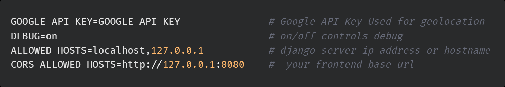

[](https://github.com/mmpc-nyc/inventory_mgmt/actions/workflows/codeql-analysis.yml) [](https://github.com/schir2/inventory_mgmt/actions/workflows/django.yml)   

# Inventory Management for tracking Equipment

## Setup


Create a **.env** in the same location where settings.py resides.


Run in powershell after creating virtual environment
```powershell
pip install -r requirements.txt
python manage.py setup_initial
```