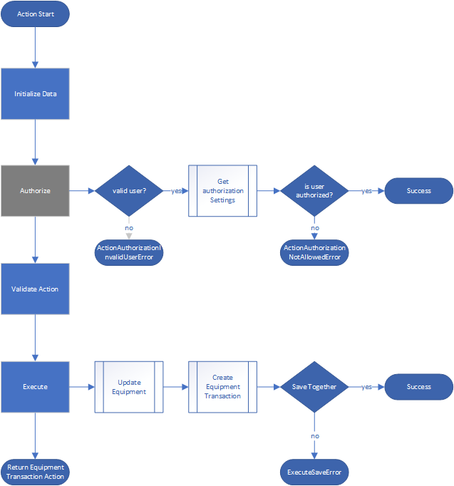

 
# Inventory Management for tracking Equipment

## Models

## Customer
## Order

## Location
## Stock
## Generic Product
## Product
## Equipment
### Actions

#### Collect
#### Deploy
#### Store
## Transaction

