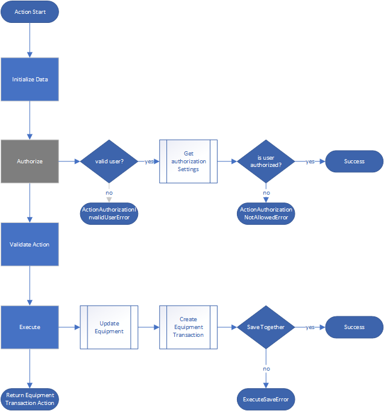

Inventory Management
# 1 Contact
A contact record for a single person
## 1.1 First Name
## 1.2 Last Name
## 1.3 Emails
A list of emails associated with the contact
## 1.4 Phone Numbers
A list of phone numbers associated with the contact
# 2 Location
A location record for a single location
# 3 Customer
## 3.1 Customer Locations
A list of locations associated with the customer
## 3.2 Customer Contacts
A list of contacts associated with the customer
# 4 Stock Location
A place where equipment and materials are stored
## 4.1 Name
Name of Stock Location/ Stock Location
## 4.2 Location
A location associated with the stock_location
## 4.3 Status
### 4.3.1 Active
A stock_location location that is available for withdrawing and storing equipment.
### 4.3.2 Inactive
A stock_location location that is not available for withdrawing or storing equipment.
### 4.3.3 Full
A stock_location location that is full and is not available for storing equipment. It is available for withdrawing equipment.
## 5.1 Category
A hierarchical way of grouping generic materials. For example, an 18 Inch Industrial Fan would be under the category of Fans, which has a subcategory of 18 inch fans.
## 5.2 Status
### 5.2.1 Active
Interchangeable Materials, Materials and Equipment can be used.
### 5.2.2 Inactive
Materials and Equipment that share this generic material will be unusable.
# 6 Material
A unique identifier for a material consisting of name, brand, material type, and generic material
## 6.1 Name
A unique name for the material
## 6.3 Brand
The brand of the material
## 6.4 Material Type
### 6.4.1 Equipment
Refer to Equipment
### 6.4.2 Material
A consumable type material that gets used. It cannot be picked up
## 6.5 Status
### 6.5.1 Active
Refer to Material Status Active
### 6.5.2 Inactive
Refer to Material Status Inactive
### 6.5.3 Recall
The material and all of its associated equipment should be recalled
# 7 Equipment
Equipment refers to tracked physical assets such as machinery and tools used in a business, that are not vehicles and are tracked for inventory purposes. These assets are depreciable and can be used to generate income or are necessary for production. The inventory tracking system maintains their quantity, location, status, maintenance and other relevant information.
## 7.1 Status
### 7.1.1 Stored
Equipment is stored in Stock Location. A user is not assigned to this equipment
### 7.1.2 Deployed
Equipment is stored at a customer location based on the order.
### 7.1.3 Picked Up
### 7.1.4 Missing
### 7.1.5 Decommissioned
## 7.2 Actions

### 7.2.1 Collect
Collects equipment from customer location and sets status to Picked Up
### 7.2.2 Decommission
Decommission’s equipment. It can no longer be used or stored. Sets status to Decommissioned
### 7.2.3 Deploy
Deploys equipment at the customer location and sets the status to Deployed
### 7.2.4 Store
Stores the equipment at stock_location and sets the status to Stored
### 7.2.5 Transfer
Transfers equipment from one user to another. Sets status to Picked Up
### 7.2.6 Withdraw
Picks up equipment from stock_location and sets status to Picked Up

# 8 Order
An order for requested services, materials or equipment. An order consists of three activities. Collect, Deploy and Inspect
## 8.1 Assigned Users
Users assigned to perform this order
## 8.2 Customer
The customer that the order is for
## 8.3 Customer Location
The customer location where this order will take place
## 8.4 Date
The date and time at which the order will take place
## 8.5 Assigned Equipment
Equipment that is associated with the order.
## 8.6 Requested Equipment
This is mainly used for deploy orders. It allows you to see if the correct amount of equipment has been deployed.
## 8.7 Activity
An activity you perform during the order.

### 8.7.1 Collect
An order for picking up deployed equipment.
#### 8.7.1.1 Actions
##### 8.7.1.1.1 Start
Starts the order, allowing the user to collect equipment via qr scanner. Sets the order status to In Progress. Equipment scanned in will be automatically assigned to the user that collects it and sets the status to Picked Up
##### 8.7.1.1.2 Complete
Completes the order and validates if all equipment was picked up. A collect order can only be completed if all equipment has been picked up. A user can choose to ignore validation errors. If this is selected then any equipment that is not picked up will be marked as missing. Sets the order status to Completed
##### 8.7.1.1.3 Cancel
Canceled the order. An order can only be canceled if all deployed equipment has been picked up. A user can choose to ignore validation errors. If this is selected then any equipment that is not picked up will be marked as missing. Sets the order status to Canceled
### 8.7.2 Deploy
An order for deploying requested equipment
#### 8.7.2.1 Actions
##### 8.7.2.1.1 Start
Starts the order, allowing the user to deploy equipment via qr scanner Sets the order status to In Progress. Equipment scanned in will be automatically assigned to the user that deploys it and sets the status to Deployed
##### 8.7.2.1.2 Cancel
Canceled the order. An order can only be canceled if all deployed equipment has been picked up. A user can choose to ignore validation errors. If this is selected then any equipment that is not picked up will be marked as missing. Sets the order status to Canceled
### 8.7.3 Inspect
An order for inspecting equipment, location, or doing a pre deployment assessment
##### 8.7.3.0.1 Start
Starts the order
##### 8.7.3.0.2 Complete
Completes the order
##### 8.7.3.0.3 Cancel
Cancel the order
## 8.8 Actions
### 8.8.1 Create
Create a new order
### 8.8.2 Create from Existing Order(s)
Create a new order from an existing order. This is used for creating links between orders as well as allowing the ability to copy assigned equipment from one or more orders to the newly created order..
### 8.8.3 Status
#### 8.8.3.1 New
A partially created order with user, date, time and or requested equipment information missing
#### 8.8.3.2 Assigned
An order with initial information filled in, including the user, date and time. This order will show up on the assigned user’s device.
#### 8.8.3.3 In Progress
An order in progress, with the ability to collect and deploy actions enabled.
#### 8.8.3.4 Completed
An order that is completed.
#### 8.8.3.5 Canceled
An order that is canceled
